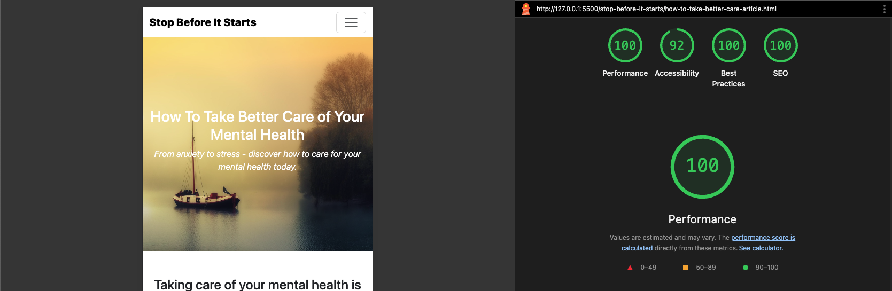
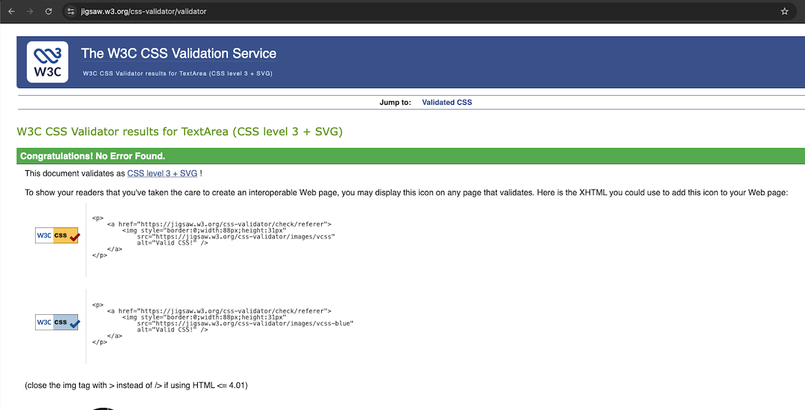

# Stop Before It Starts

---

## Stop Before It Starts - A mental health website designed to provide support, resources, and uplifting content. Users can access helpful information, positive articles, tips, and engaging content to support their mental well-being.

## [View Stop Before It Starts now on GitHub Pages](https://lmkh.github.io/stop-before-it-starts/)

---

## Table of Contents

### Website Purpose

The name reflects the mission: **to help stop a mental health crisis before it starts**. What the 'it' represents is unique to each individual, yet deeply familiar to those who struggle.

This website is intended to be a **sanctuary** for people with complex needs - a safe place to find reliable resources such as links to mental health support services, and guidance in times of need.

Beyond immediate support, the site also serves as a hub for **insightful, everyday wellness content**. Visitors can explore articles on topics like:

-   How To Take Better Care of Your Mental Health
-   Simple Steps to Boost Your Mental Well-Being
-   How to Reconnect and Be Present with Nature

The goal is to empower users with knowledge, strategies, and encouragement to strengthen their mental health in both life and difficult moments.

### User Experience

**_Stop Before It Starts_** has been designed with simplicty and accessibilty at its core. Whether users visit on mobile, tablet, or desktop, they can find the support and resources they need.

The site demonstrates strong technical quality, with between **97% to 100% Lighthouse performance score** and fully **validated code**, ensuring fast loading, reliability, and compliance with web standards. (**See screenshots below**)

#### User Stories
