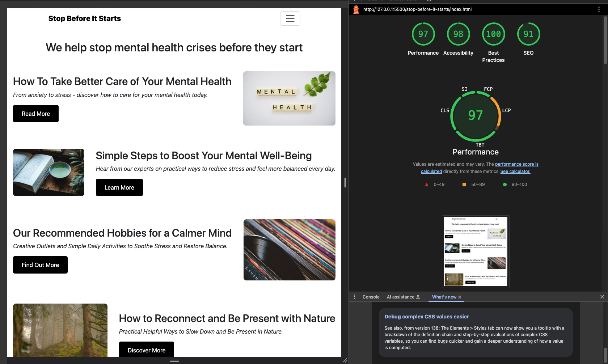

# Stop Before It Starts

---

## Stop Before It Starts - A mental health website designed to provide support, resources, and uplifting content. Users can access helpful information, positive articles, tips, and engaging content to support their mental well-being.

## [View Stop Before It Starts now on GitHub Pages](https://lmkh.github.io/stop-before-it-starts/)

---

## Table of Contents

-   [Website Purpose](#website-purpose)
-   [User Experience](#user-experience)
-   [Features & Screenshots](#features--screenshots)
-   [Wireframe](#wireframe)
-   [Deployment](#deployment)
-   [AI Augmentation](#ai-augmentation)
-   [End Credits](#end-credits)

### Website Purpose

The name reflects the mission: **to help stop a mental health crisis before it starts**. What the 'it' represents is unique to each individual, yet deeply familiar to those who struggle.

This website is intended to be a **sanctuary** for people with complex needs - a safe place to find reliable resources such as links to mental health support services, and guidance in times of need.

Beyond immediate support, the site also serves as a hub for **insightful, everyday wellness content**. Visitors can explore articles on topics like:

-   How To Take Better Care of Your Mental Health
-   Simple Steps to Boost Your Mental Well-Being
-   How to Reconnect and Be Present with Nature

The goal is to empower users with knowledge, strategies, and encouragement to strengthen their mental health in both life and difficult moments.

### User Experience

**_Stop Before It Starts_** has been designed with simplicty and accessibilty at its core. Whether users visit on mobile, tablet, or desktop, they can find the support and resources they need.

The site demonstrates strong technical quality, with between **97% to 100% Lighthouse performance score** and fully **validated code**, ensuring fast loading, reliability, and compliance with web standards. (**See screenshots below**)

#### User Stories

##### First Time Visitor Goals

-   **As a first-time visitor**, I want to easily find helpful information on mental health support.
-   **As a first-time visitor**, I want to quickly locate links to trusted mental health resources.
-   **As a first-time visitor**, I want to read engaging articles on ways to improve my mental well-being.
-   **As a first-time visitor**, I want to access practical tips on how to reduce stress.

##### Returning Visitor Goals

-   **As a returning visitor**, I want to see new and up-to-date articles on mental health and well-being.
-   **As a returning visitor**, I want access to inspirational quotes or content that can support me in daily life.

##### Frequent Visitor Goals

-   **As a frequent visitor**, I want to quickly access my favourite or previously read articles so I can continue learning and benefiting from the content.

### Features & Screenshots

Below are some key features of **Stop Before It Starts**, along with screenshots that demonstrate the functionality and user benefits:

#### Homepage

The homepage provides a welcoming entry point for users, with a clean design and accessible layout. It highlights articles that support mental health and well-being.

#### Responsive Navbar

The navigation bar is fully responsive, adapting seamlessly to mobile screens. This ensures that users can quickly find what they need regardless of the device they're using.

#### Article with Resources

Articles are designed to be both engaging and practical. For example, the below articles helpful resource links, giving users immediate access to external support and further reading.

### Wireframe

I use **Figma** to help plan and design websites. It allows me to quickly turn ideas into structured layouts, which is something I've been doing for a while now. This process helps me visualise and refine concepts before moving into development.

The screenshot below shows the planning stage for the **Stop Before It Starts** homepage, designed accross **desktop, tablet, and mobile sizes** to ensure responsive layouts.

If you would like to view the **interactive wireframe**, please contact me directly.

Below is the initial wireframe created for **Stop Before It Starts**:

### Deployment

This site is being deployed using **GitHub Pages**. See below link.

## [View Stop Before It Starts now on GitHub Pages](https://lmkh.github.io/stop-before-it-starts/)

How I deployed this site was by:

1. Logging in to GitHub
2. Finding this project's repository.
3. Clicking on the Settings link.
4. Clicking on the Pages link - located in the left-hand navigation menu.
5. In the source section, this is where I selected the root from the drop-down menu.
6. Once this was saved, GitHub Pages deployed my site at the respective URL.

### AI Augmentation

#### Examples

Throughout this project, I used ChatGPT as a support tool to guide me in writing and improving code. For example, I referred to AI assistance when learning how to correctly structure Bootstrap components and to better understand best practices, such as writing clear and professional README documentation.

AI was not used to build the entire project, but rather to:

-   Clarify and teach me coding concepts I was less familiar with (e.g., Bootstrap).
-   Guide me on best practices, such as writing a clear README.
-   Improve efficiency by quickly testing solutions instead of searching documentation manually.

This approach allowed me to stay focused on the project objectives, while using AI strategically to strengthen my skills and accelerate the development process.

#### Debugging

I also used ChatGPT to assist with debugging when I encountered issues in my code. For example, when trying out new concepts for the first time, I often wasn't sure why my code wasn't working. By pasting the code into ChatGPT, I was able to:

-   Identify errors more quickly.
-   Receive suggested corrections and explanations, which in turn helped me learn more.
-   Learn from the debugging process so I could avoid similar mistakes in the future.

This made debugging more efficient and helped me build a stronger understanding of any underlying issues.

#### Improving Performance and UX

AI was used to help optimise code for performance and user experience by:

-   Suggesting cleaner and more efficient code structures.
-   Recommending accessibility and readability improvements.
-   Supporting best practices that contributed to a Lighthouse score of above 97% and passing validation checks.

#### AI's Role in Development

AI tools, such as ChatGPT, supported multiple aspects of the development process, from clarifying coding concepts to debugging and optimising performance.

The use of AI improved efficiency, reduced time spent troubleshooting, and enhanced understanding of best practices, ultimately contributing to cleaner code, better UX, and faster project completion.

### End Credits

Created by **Liam Kavanagh** 2025

#### Acknowledgements

-   Guidance was assisted by ChatGPT for learning and understanding purposes.
-   The navigation bar, was adapted from previous lessons.

#### Media

##### All media kindly used from Pixabay.

1. **_Forest_** by Juncala
2. **_Boat_** by earthroom
3. **_Mental Health_** by Total Shape
4. **_Reading Tea Time_** by Mirkostoedter
5. **_Vinyl Records_** by Bru-n0
